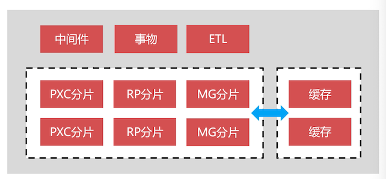

# 新零售业务介绍

## 新零售是什么？

雷军说：新零售是更高效的零售，我们要从线上回到线下。不是原路返回，**通过互联网的工具和方法提升传统零售的效率实现融合**。三四线城市更喜欢线下的零售模式

马云说：线下与线上零售将深度结合，加上现代物流平台，构成未来的新零售；阿里巴巴推出了天猫超市、盒马生鲜线下零售，验证了阿里巴巴线下发展的意愿。

商务部：以消费者体验为中心，以技术创新为驱动的零售新模式。

简单概况：利用各种创新技术将线上与线下业务结合起来的一种零售模式，其实上新零售是互联网+的一种延伸

## 新零售线上业务仅是电商吗？

线上业务不局限于电商，还包括在线教育、医疗服务、以及金融业务等；

比如：在淘宝搜索「医院预约」，出来的是商品、书籍，而不是我们需要的预约挂号之类的，可见电商系统擅长的是 **商品销售**，对服务类业务显得无能为力。

再比如：在某课购买课程，线上学习，这种学习体验也是淘宝京东无法带给我们的。

## 新零售的线下业务

线下无论出售的是商品还是服务，都可以利用云计算、大数据，以及人工智能技术，将客户分流到线下门店中，让用户体验到定制化的服务。

传统的零售模式：

- 用户来到门店
- 服务人员问询，掌握一定的需求
- 提供相应的服务或则产品

如果同时到店的客户非常多，就需要排队，这种体验非常的不好。

有了新零售之后，通过线上的平台，了解了客户的需求之后，商家做好准备工作，减少了客户等待时间，提高了商家的工作效率。

举个例子：比如我的私家车需要做保养，但是线上 APP 是无法做到这个事情的，线上线下业务就结合起来了。在线上选择好保养的项目以及预约到店的时间，线下商家备好货，到时直接就可以做保养了。

这就是新零售的一种方式，线上线下结合，既方便又快捷。以互联网+ 的思维去连接工厂、门店、微商，这就是新零售。

## 新零售平台构成

一般有以下 4 个渠道，除了第一个，其他的都是线上

一般很少有企业全面发展，比如万达从线下往线上发展，淘宝京东是从线上往线下发展。

那么渠道的发展顺序一般为（基于成本考虑）：

1. 小程序

   企业可以利用小程序起家，小程序的成本是最低的，一般是适合小程序开始，但是小程序的打包体积不能超过 2M，所以不能定义太多的界面。

2. APP

   接下来就可以开发 APP，移动端发展，比如拼多多，发展很壮大了，都没有自己的购物网站。拼多多继续发展壮大的话，后续就很有可能会开发 PC 端产品，附加更多的内容。

3. 网站

   这个时候，用户活跃多，在架构上就能采用数据库集群、消息队列、微服务等等一系列技术。

   开发一个网站的成本很大，如上面所说的成本起家历程来说，达到这个阶段的话，这些成本企业一般都是可以承受的了。

4. 线下门店

   要用真实的商品、备注货源、要有门店和店员，投入是非常巨大的

比如盒马生鲜这种规模的门店，不适合短时间内在全国开很多家，投入巨大，企业承担不起。一家一家来

## 本课程与新零售的关系

为新零售平台搭建出一个数据库系统。网上有很多讲解电商的课程，由于篇幅原因，基本上都是 **以点带面**，讲解几个模块，草草收尾。

本课程虽然讲解的数据库，但是为带领大家搭 **建出一个完整的数据库平台**。我们锁定的目标是：

-  中小型企业

  广大中小型企业的新零售需求

- 日活跃用户 5 万以下

  指 APP 或 小程序的日活跃用户

- 最佳的性价比方案

  通过优化数据表和 sql 语句找到最佳的性价比方案

- 适用于多平台业务

  设计出来的数据库，可用在 java、php 等系统上

## 业务扩展后的数据库架构变化

关键词是：架构、性能、成本、重构，从这几个方面考虑

随着新零售的发展，从移动端迈向网站，原本的单节点 MySQL 就会遇到瓶颈，这个时候就需要寻找一个新的数据库架构。

本课程后半段，在高负载下，如何设计出百万 PV 的数据库平台。提高数据库负载，不仅仅是用上数据库集群那么简单。比如 MySQL 的集群方式就有很多种

高负载带来的问题之一就是大数据量，InnoDB 单表数据超过 2000 万时，性能可能会严重下降。最好的办法就是对数据进行切分，存储到不同的 MySQL 节点上。这里就又牵涉到分布式的相关的东西，节点高可用、读写分离、分布式事物等问题的出现。

- pxc 集群：每个节点都必须同步接受数据

- rp 集群：每个节点是异步接受数据的

  只要一个节点成功接受数据，那么事务就算成功了，如果由于网络原因，读写分离情况下，就可能导致扣款成功，但是订单状态同步失败的问题

由于同步方式的不同，他们适合的场景也是不同（规避优缺点）；所以：

- pxc ：适合保存强一致性数据

  如：订单、用户信息等

- rp：不适合保存强一致性数据

  比如，用户评价、商品信息等。

如果说一项业务既操作了 pxc 又操作了 rp 的数据，这种跨集群的事物就很难实现。包括跨集群联合提取数据，也是很难的。

所以：**高负载的数据库设计不是那么好设计的**

在本课后半段会讲解如何搭建这种高负载的数据库平台。
