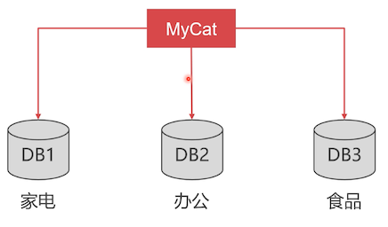

# 主键用数字还是 UUID？

## 什么是 UUID？

UUID 是通用唯一识别码的缩写，其目的是让分布式系统中的所有元素，都能具有唯一的辨识信息，而不需要通过中央控制端来做辨识信息的指定。

下面是 UUID 的组成


```sql
-- 数据库中使用 uuid 函数
select uuid();
```

## 为什么有人想要使用 UUID？

在数据库集群中，为了避免每个 MySQL 各自生成的主键产生重复，所以有人考虑采用 UUID 方式


如果采用自增模式，会出现全局 ID 冲突。

## UUID 主键的好处

- 分布式生成主键，减低了全局节点的压力，使得主键生成速度更快

- 主键全局唯一

- 跨服务器合并数据很方便

  从第 2 条中派生出来的。由于 ID 唯一，所以整合方便。

## UUID 主键的缺点

- 浪费存储空间

  UUID 占用 16 个字节，比 4 字节的 int 类型和 8 字节的 bigint 类型更占用存储空间。

  在聚簇索引上，非主键列都会携带主键值，所以更占用空间

- 查询速度慢

  UUID 是字符串，查询速度慢；

  这个往深了说，还是和 B-Tree 有关。

- 数据写入随机性很大

  UUID 不是顺序增长，作为主键，数据写入 IO 随机性很大；

  这个往深了说，还是和 B-Tree  和存储机制有关。

## 主键自动增长的优点

- 占用空间少：int 和 BIGINT 类型占用存储空间少
- 检索速度快：MySQL 检索数字类型速度远快于字符串
- IO 写入连续性好：由于主键是顺序增长的，写入连续性好

## 分布式环境下的主键自动增长

有人想要使用 UUID 作为主键，就是在分布式环境下主键会全局冲突的问题。



比如 MyCat 中间件，就可以生成全局连续的主键值。

## 总结

无论什么场合，都不推荐使用 UUID 作为数据表的主键；

分布式环境下有类似 MyCat 这样的中间件来生成全局的顺序主键
