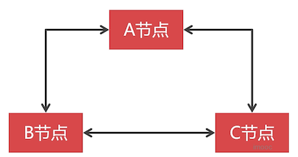

# 搭建 PXC 集群

PXC 中一般保存高价值的数据，所以很重要

## PXC 集群介绍

Percona XtraDB Cluster 是业界主流的 MySQL 集群方案，在性能上甚至可以比肩 MySQL 企业版。

最关键的一个特性：PCX 集群的 **数据同步具有强一致性的特点**。**只支持 InnoDB 引擎**

连阿里数据库 oceanbase 开发都借鉴了 PXC 的原理。

本课程不是深入讲解 PXC 集群的，该讲师有另外一门课程叫《MySQL 数据库集群-PXC 方案》，是专门讲解 PXC 集群的。

本章只是讲解怎么把 PXC 集群搭建起来

## 数据库运行在 Docker 中问题

- 数据库运行在 Docker 里有性能问题吗？

  MySQL 放在容器中运行不会有性能损耗，Docker 虚拟机是轻量级的，没有虚拟硬件，也没有安装操作系统，直接使用宿主机的 linux 内核。

- 数据保存到容器中，如果容器崩溃，如何提取数据？

  因为容器是可读写的，所以数据可以存放在容器中。宿主机无法访问容器内部的文件，无法从崩溃的容器中吧数据提取出来。

  但是可以给容器做 **目录映射**，或则 **挂载数据卷**

## 开启防火墙端口

在搭建 swarm 集群时，开启了 2377 端口还需要开启，7946 和 4789 端口，他们是 swarm 集群通信的端口，并且还要开放 TPC 和 UDP 协议。

```bash
# 管理节点上开启  2377，
# 可以在 swarm 集群中设置多个管理节点，所以下面的端口开放在集群节点上都操作一下
firewall-cmd --zone=public --add-port=2377/tcp --permanent
firewall-cmd --zone=public --add-port=7946/tcp --permanent
firewall-cmd --zone=public --add-port=7946/udp --permanent
firewall-cmd --zone=public --add-port=4789/tcp --permanent
firewall-cmd --zone=public --add-port=4789/udp --permanent
firewall-cmd --reload
```

注意：修改端口之后，需要重新启动 docker 服务，才会生效

```bash
systemctl restart docker
```

## 下载 PXC 镜像

该镜像中包含了 Percona 数据库，所以不用单独安装数据库了

```bash
# 下载下来之后，重命名为 pxc 然后删除原来长名称的
# 下载最新版的 PXC 镜像
docker pull percona/percona-xtradb-cluster
docker tag percona/percona-xtradb-cluster pxc
docker rmi percona/percona-xtradb-cluster
```

该镜像是 percona 官方的一个镜像，详细说明 [请阅读镜像说明](https://hub.docker.com/r/percona/percona-xtradb-cluster)

需要在三个节点上都下载 PXC 镜像

## PXC 的主节点容器

第一个启动的 PXC 节点是主节点（临时的），它要初始化 PXC 集群，PXC 启动之后，就没有主节点角色了。

集群中 **每一个节点的地位都是相同的**，**任何节点都可以读写数据**

## 创建主节点容器

创建主节点之后，需要等待一会儿，才能连接，它要去做一些初始工作

```bash
# -d：不进入交互界面
# -p：端口映射
docker run -d -p 9001:3306
-e MYSQL_ROOT_PASSWORD=123456			# 数据库 root 密码
-e CLUSTEER_NAME=PXC1
-e XTRABACKUP_PASSWORD=123456			# pxc 集群之间数据同步的密码
-v pnv1:/var/lib/mysql --privileged		# 数据卷的挂载
--name=pn1		# 给当前容器起名，可以自己随意定义
--net=swarm_mysql		# 加入虚拟网络名称
pxc			# 容器从哪一个镜像上创建
```

数据卷简单理解：一个虚拟的磁盘，把它挂载到了 `/var/lib/mysql` 这个目录上

下面是实际操作命令，记得需要在三台机器上

```bash
[root@study ~]# docker run -d -p 9001:3306 -e MYSQL_ROOT_PASSWORD=123456 -e CLUSTEER_NAME=PXC1 -e XTRABACKUP_PASSWORD=123456 -v pnv1:/var/lib/mysql --privileged --name=pn1 --net=swarm_mysql pxc
d86cb7982cbcca2c74e1cd17f5783452caa80f141081b13f570aa55a10040930
```

稍等一会，就可以通过 Navicat 之类的工具连接这台机器的 9001 端口，连接上数据库了

## 创建从节点容器

必须等待主节点可以访问了，才能创建从节点，否则会闪退

```bash
# -d：不进入交互界面
# -p：端口映射
docker run -d -p 9001:3306
-e MYSQL_ROOT_PASSWORD=123456			# 数据库 root 密码
-e CLUSTEER_NAME=PXC1
-e XTRABACKUP_PASSWORD=123456			# pxc 集群之间数据同步的密码
-e CLUSTER_JOIN=pn1								# 连接到 pn1 节点
-v pnv2:/var/lib/mysql --privileged		# 数据卷的挂载
--name=pn2		# 给当前容器起名，可以自己随意定义
--net=swarm_mysql		# 加入虚拟网络名称
pxc			# 容器从哪一个镜像上创建
```

参数上和主节点的创建类似。以此类推，把其他剩余的节点加入到 pn1 节点中

```bash
[root@study ~]# docker run -d -p 9001:3306 -e MYSQL_ROOT_PASSWORD=123456 -e CLUSTEER_NAME=PXC1 -e XTRABACKUP_PASSWORD=123456 -e CLUSTER_JOIN=pn1 -v pnv2:/var/lib/mysql --privileged --name=pn2 --net=swarm_mysql pxc
```

创建从节点后，可以用 Navicat 去连接下它，检查是否可以连接上；

测试 pxc 集群是否生效：前面说过，在 pxc 集群中的所有节点都是对等的，在任意一个节点上创建一个数据库，然后去其他节点查看是否真的能看到

## 管理 Docker 数据卷

### 什么是数据卷？

数据卷相当于 **给容器挂载一个虚拟的磁盘**，该虚拟机磁盘是 **可以在宿主机中访问的**，即便容器挂掉了，数据还存在

什么不挂载目录？目录不能挂载到多个容器上，但是数据卷可以。**而且 PXC 容器只支持挂载数据卷**

### 管理数据常用指令

```bash
# 数据卷列表
docker volume ls
# 创建数据卷
docker volume create test
# 删除数据卷，如果挂载了容器，则不能删除；先删除容器，再删除数据卷
docker volume rm test
# 清除没有挂载的数据卷
docker volume prune
# 查看数据卷详情
docker volume inspect pnv1
```

创建容器时，如果指定的数据卷没有创建，则会帮我们创建好，再挂载到容器上。

下面来看看我们 pxc 集群节点上的数据卷

```bash
[root@study ~]# docker volume ls
DRIVER              VOLUME NAME
local               af0abed08ee3a142ff11f37fb57af53739c3590f45edde4024a987496691e82b
local               pnv1

[root@study ~]# docker volume inspect pnv1
[
    {
        "Driver": "local",
        "Labels": null,
        "Mountpoint": "/var/lib/docker/volumes/pnv1/_data",
        "Name": "pnv1",
        "Options": {},
        "Scope": "local"
    }
]

# 然后进入到这个目录
[root@study _data]# cd /var/lib/docker/volumes/pnv1/_data
[root@study _data]# ls
auto.cnf    client-cert.pem   demo          gvwstate.dat    ib_logfile0  innobackup.backup.log  private_key.pem  server-key.pem   version_info
ca-key.pem  client-key.pem    galera.cache  ib_buffer_pool  ib_logfile1  mysql                  public_key.pem   sst_in_progress  xb_doublewrite
ca.pem      d86cb7982cbc.pid  grastate.dat  ibdata1         ibtmp1       performance_schema     server-cert.pem  sys
# 可以看到存放着数据库的文件，那个 demo 目录，就是我测试 pxc 集群的时候创建的一个逻辑库
```

## PXC 集群注意事项

集群搭建起来了，会遇到一些使用上的问题，比如关闭电脑之后，下次再启动 PXC 节点，这些容器就会闪退。

### PXC 集群结构

笔者因为内存不太够用了，只搭建了 3 台虚拟机，视频中是 4 台哈。

|  虚拟机  |    IP 地址     | 端口 | 容器 | 数据卷 |
| :------: | :------------: | :--: | :--: | :----: |
| docker-1 | 192.168.56.105 | 9001 | pn1  |  pnv1  |
| docker-2 | 192.168.56.107 | 9001 | pn2  |  pnv2  |
| docker-3 | 192.168.56.108 | 9001 | pn3  |  pnv3  |

### 从节点启动后闪退 1

如果主节点没有完全启动成功，从节点就会闪退；

这种情况下，只要等待主节点启动成功，使用 Navicat 链接，可以访问的话，就可以了

### 从节点启动后闪退 2

这种情况就比较复杂了。先记住这一个结论：**PXC 最后退出的节点要最先启动，而且要按照主节点启动**

PXC 认为最后退出的节点的 **数据是最新的**，所以需要最先启动，然后启动其他的节点，就会自动的同步数据

它的实现大概是：给最后退出的节点打了一个标记，启动时检查这个标记，如果自己没有这个标记，就会 **闪退**

比如下面由 A 、B 两个节点组成的 PXC 集群，先启动的 A 节点，再让 B 节点加入的 A 节点


**模拟故障：**A 节点先退出，然后 B 节点也挂掉了。再次启动 B 节点时会闪退，原因是：**Docker 不能更换容器启动命令**，所以 B 节点无法按照主节点启动

**解决办法 1：** 修改最后退出节点标识到 A 节点上，就不用修改容器启动命令了

修改数据卷中的  `grastate.dat` 文件

```bash
# 把该参数修改为 0
safe_to_bootstrap = 0
```

`safe_to_bootstrap = 1` 代表该节点是最后退出的节点，需要按照主节点启动；但是现在 B 节点无法按照主节点来启动，就把 B 节点修改为 0，A 节点修改为 1，先启动 A 容器，再启动 B 容器 

**解决办法 2：** 重新创建容器

1. 删除 A、B 容器
2. 先启动的容器把原来 B 节点的数据卷挂载上来
3. 后启动的容器加入 B 节点的集群，挂载原来 A 节点的数据卷

::: tip

注意：使用 docker 镜像搭建的集群，从节点最后退出的话， `safe_to_bootstrap` 还是 0，这是因为在 Percona 制作镜像时特意处理的，因为上面我们说了，无法修改容器命令启动。

使用容器方式搭建：

1. 从节点最后退出，先启动的话，也会闪退，是因为找不到主节点
2. 主节点先退出，先启动的话，也会闪退，因为它的标志为 0，不是最后退出，所以还是要修改主节点的 safe_to_bootstrap

但是不使用 docker 容器来搭建，就是上面讲解的哪个样子

:::

### 主节点启动后闪退 1

要明白的是：PXC 启动之后，所有节点的 ``safe_to_bootstrap` 都是 0；

如果所有 PXC 节点同时意外关闭（如停电），所有节点 `safe_to_bootstrap` 都是 0，所以主节点无法启动

### 主节点启动后闪退 2

如果 **PXC 集群正在运行**，宕机的主节点不能按照主节点启动；

**解决办法：**

1. 删除容器，检查 `safe_to_bootstrap` 是否为 0，如果不为 0 则修改为 0
2. 以从节点方式创建容器，加入集群（从存活中的任意节点选一个加入就可以）

### 创建从节点加入 PXC 集群的注意事项

因为 PXC 集群的中 **每一个节点地位都是平等的**，可以使用任何 PXC 节点，然后从节点加入  PXC 集群。


比如：创建容器时 A 节点为主节点，B 节点以从节点加入的集群，C 节点可以链接 B 节点进入集群。

**注意的是：** 如果重新启动 C 节点，就必须保证 B 节点可以访问

## 搭建 PXC 集群分片

前面搭建了一个 PXC 集群，由于有多个 MySQL 节点，挂掉其中一个，PXC 集群还是可以使用的，而且多个 MySQL 节点处理读写请求比单节点好很多很多。

但是这还不够，下面来了解下

### PXC 集群的特点

PXC 节点之间，数据同步是双向的，而且是强一致性的。



比如，三个节点，每个节点都可以写入数据，也都可以读取数据。

那么得出一个结论：**PXC 集群中的节点不能太多**，否则会 **影响节点数据写入速度**（因为是强一致性同步的），

**一般不要超过 15 个节点**

### 数据同步带来的问题

无论在哪个节点写入数据，最终所有节点的数据都是相同的。

那么这就失去了数据切分的特性，有 2000 万数据，不能分散存储到某一个节点上。

为了 **实现数据切分的效果**，我们必须新组建一个 PXC 集群，每个 PXC 集群上存储一部分数据


这样一来，再在前面增加一层例如 MyCat 之类的数据分片软件，将不同的数据路由到不同的 PXC 集群中去

**专业术语：** 以这个方案来实现的话，上图中的每一个 PXC 集群都是一个分片。

**需要注意的是：** 并不是无休止的增加数据分片，而是可以考虑将数据做冷热分离，将长期不使用的数据归档。如何搭建 TokuDB 归档数据库，可以去转该老师的 PXC 集群专讲课程

### PXC 集群结构

本机资源有限，搭建两个 PXC 集群，用来主键集分片，分配如下

PXC 1

|  虚拟机  |    IP 地址     | 端口 | 容器 | 数据卷 |
| :------: | :------------: | :--: | :--: | :----: |
| docker-1 | 192.168.56.105 | 9001 | pn1  |  pnv1  |
| docker-2 | 192.168.56.107 | 9001 | pn2  |  pnv2  |
| docker-3 | 192.168.56.108 | 9001 | pn3  |  pnv3  |

PXC 2

|  虚拟机  |    IP 地址     | 端口 | 容器 | 数据卷 |
| :------: | :------------: | :--: | :--: | :----: |
| docker-1 | 192.168.56.105 | 9002 | pn4  |  pnv4  |
| docker-2 | 192.168.56.107 | 9002 | pn5  |  pnv5  |
| docker-3 | 192.168.56.108 | 9002 | pn6  |  pnv6  |