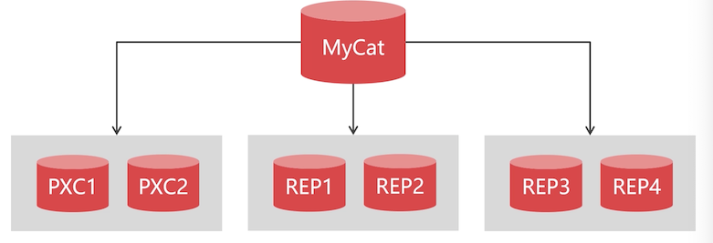

# Mycat 垂直/水平切分/全局表

垂直切分和水平切分，前面练习的时候已经实现了

## 垂直切分

就是把数据表 **切分成独立的逻辑库**

将不同的集群划分为一个逻辑库，然后交给 mycat 来管理。

## 水平切分

MyCat 具有很多 **水平切分算法**，用户可以随意定制切分规则。

比如前面的 student 表的取模将数据路由到某一个分片上去。

下面列出一些水平切分的算法。先混个脸熟

|  分片算法  | 使用场景                   | 案例            |
| :--------: | -------------------------- | --------------- |
|  主键球模  | 初始数据很多，但是增幅较慢 | 地图数据        |
|   枚举值   | 绝大多数场合               | 58 同城、饿了么 |
|  日期分片  | 按照日期查找数据           | 日志数据        |
| 自然月分片 | 按照日期查找数据           | 财务数据        |
| 冷数据分片 | 冷热数据分离               | 订单数据        |

- 枚举值：根据一些值决定路由到哪个分片上

  比如 58 上浏览网站，需要先让你选择所在城市，然后出现相关的网站内容；招聘、租房等都是按照城市来分片的；

- 日期分片：

  可以按照天来分片，做数据统计和分析就比较方便；

- 自然月分片：每个月的数据存到一个分片

## Mycat 性能参数

这些都在 Mycat 手册上有相关说明，这里介绍一些，其他的去手册上看

- 每天 2 亿数据的实时查询案例（手册 239 页）
- 物联网 26 亿数据的案例（手册 241 页）
- 大型分布式零售系统案例（首次 241 页）

