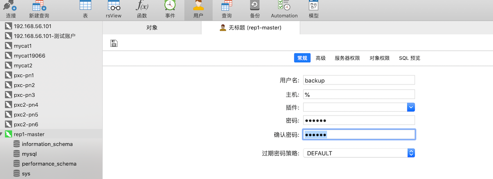

# 高可用 Replication 集群

上一章，创建了第一组的 3 个容器

REP 1

|  虚拟机  |    IP 地址     | 端口 |  容器  | 数据卷 |
| :------: | :------------: | :--: | :----: | :----: |
| docker-1 | 192.168.56.105 | 9003 | rn1(m) |  rnv1  |
| docker-2 | 192.168.56.107 | 9003 | rn2(s) |  rnv2  |
| docker-3 | 192.168.56.108 | 9003 | rn3(m) |  rnv3  |
| docker-1 | 192.168.56.105 | 9004 | rn4(s) |  rnv4  |

REP 2

|  虚拟机  |    IP 地址     | 端口 |  容器  | 数据卷 |
| :------: | :------------: | :--: | :----: | :----: |
| docker-2 | 192.168.56.107 | 9004 | rn5(m) |  rnv5  |
| docker-3 | 192.168.56.108 | 9004 | rn6(s) |  rnv6  |

由于这里，笔者没有开 4 台虚拟机，所以只完成了第一个集群的双主搭建，第二个集群还是单主

```bash
# 前面创建了 rn1 容器，这里创建 rn2 容器
# 同时把 rn3 和 rn4 也创建好
[root@study ~]# docker run -d -p 9003:3306 --name rn2 -e MYSQL_ROOT_PASSWORD=123456 -v rnv2:/var/lib/mysql --privileged --net=swarm_mysql mysql
```

## 创建同步账户

从节点需要先登录到主节点，然后才可以复制 binlog 日志，所以要在 **主节点** 上创建一个用于数据同步的账户

::: tip 注意

因为 root 用户权限太高，默认也是不允许远程登录，我们创建普通用户来同步数据。

另外，注意：**在开启 binlog 日志之前创建同步用户**。否则只能删掉容器从来了。

:::

为了方便，使用 UI 来创建用户



在服务器权限里面勾选 3 个权限：Super、Reload、Replication Slave

## 配置主节点

修改配置文件 `/etc/mysql/my.cnf` ，加上如下参数

```bash
[mysqld]
character_set_server = utf8
server_id = 1001
log_bin = mysql_bin
relay_log = relay_bin
log-slave-updates = 1
sql_mode = NO_ENGINE_SUBSTITUTION,STRICT_TRANS_TABLES
```

- `server_id`：在 Replication 集群节点中的名称，一个唯一标识

- `log_bin`：开启 binlog 日志，日志名字为 mysql_bin

- `relay_log`：开启 relay_log 日志，并对日志命名

  由于配置的是双主，即是主、也是从。所以要开启

- `log-slave-updates`：

  由于是要配置双主，在 rn3 节点中，rn1 是从节点，所以从节点要把查询语句也记录在 binlog 日志中，rn3 才能同步到写入的数据。

- `sql_model`：这里主要设置的是数据同步的模式

  `NO_ENGINE_SUBSTITUTION`：创建表的时候，不指定引擎，用默认的 InnoDB

  `STRICT_TRANS_TABLES`：使用事物，在执行 事物 SQL 的时候，执行失败就回滚

配置文件不是存放在数据卷中的，所以需要在容器中修改，容器安装 vim 如果慢的话，可以尝试使用数据卷来做中转目录:

- 拷贝配置文件在数据卷中，在宿主机上修改

  ```bash
  [root@study ~]# docker exec -it rn1 bash
  root@31c9dda3c63c:~# cp /etc/mysql/my.cnf /var/lib/mysql
  ```

  

- 再把数据卷中的配置文件覆盖原位置的配置文件

  ```bash
  root@31c9dda3c63c:~# cp /var/lib/mysql/my.cnf /etc/mysql
  ```

  

修改完成之后，重启 rn1 容器，然后去数据卷中查看是否有 binlog 的日志文件产生。如果没产生，貌似只能删掉容器重新来一次了，起不起来，就进入不了容器，也修改不了配置文件（肯定是配置文件写错了导致的）

```bash
cd /var/lib/docker/volumes/rnv1/_data
# 能看到如下文件，就表示可 binlog 开启了已经
-rw-r----- 1 polkitd input      154 6月  22 01:19 mysql_bin.000001
-rw-r----- 1 polkitd input       19 6月  22 01:19 mysql_bin.index
```

在 index 中保存了创建的所有 binlog 日志文件名称。

那个 relay_log 要连接上主节点，自己作为从节点复制的时候才会出现 relay_log 的文件

再把 rn3 也按照这个配置一下，server_id 记得不要重复了。

## 配置从节点

修改配置文件 `/etc/mysql/my.cnf` ，加上如下参数

```bash
[mysqld]
character_set_server = utf8
server_id = 1002
log_bin = mysql_bin
relay_log = relay_bin
read-only = 1

```

- `read-only`：从设置为只读。普通账户只能读

配置完成后，重启对应的容器，这里配置了 rn2 和 rn4

## 设置主从同步

在 **从节点上** 执行如下的语句

```bash
# 停止同步服务
stop slave;

# 改变 master
# 在 Swarm 中 ip 不是固定的，建议写主机名，也就是容器名
# 包括端口也是容器的端口
# 因为这个是容器和容器间的交互
change master to master_host='rn1',master_port=3306,master_user='backup',master_password='123456';

# 开启同步服务
start slave;
```

注意 master_host ，rn2 连接的是 rn1，rn4 连接的是 rn3，我们之前的规划别搞混了。

## 检查主从同步状态

在从节点上执行 `show slave status` ，查看结果

| Slave\_IO\_State | Master\_Host | Master\_User | Master\_Port | Connect\_Retry | Master\_Log\_File | Read\_Master\_Log\_Pos | Relay\_Log\_File | Relay\_Log\_Pos | Relay\_Master\_Log\_File | Slave\_IO\_Running | Slave\_SQL\_Running | Replicate\_Do\_DB | Replicate\_Ignore\_DB | Replicate\_Do\_Table | Replicate\_Ignore\_Table | Replicate\_Wild\_Do\_Table | Replicate\_Wild\_Ignore\_Table | Last\_Errno | Last\_Error | Skip\_Counter | Exec\_Master\_Log\_Pos | Relay\_Log\_Space | Until\_Condition | Until\_Log\_File | Until\_Log\_Pos | Master\_SSL\_Allowed | Master\_SSL\_CA\_File | Master\_SSL\_CA\_Path | Master\_SSL\_Cert | Master\_SSL\_Cipher | Master\_SSL\_Key | Seconds\_Behind\_Master | Master\_SSL\_Verify\_Server\_Cert | Last\_IO\_Errno | Last\_IO\_Error | Last\_SQL\_Errno | Last\_SQL\_Error | Replicate\_Ignore\_Server\_Ids | Master\_Server\_Id | Master\_UUID | Master\_Info\_File | SQL\_Delay | SQL\_Remaining\_Delay | Slave\_SQL\_Running\_State | Master\_Retry\_Count | Master\_Bind | Last\_IO\_Error\_Timestamp | Last\_SQL\_Error\_Timestamp | Master\_SSL\_Crl | Master\_SSL\_Crlpath | Retrieved\_Gtid\_Set | Executed\_Gtid\_Set | Auto\_Position | Replicate\_Rewrite\_DB | Channel\_Name | Master\_TLS\_Version |
| :--- | :--- | :--- | :--- | :--- | :--- | :--- | :--- | :--- | :--- | :--- | :--- | :--- | :--- | :--- | :--- | :--- | :--- | :--- | :--- | :--- | :--- | :--- | :--- | :--- | :--- | :--- | :--- | :--- | :--- | :--- | :--- | :--- | :--- | :--- | :--- | :--- | :--- | :--- | :--- | :--- | :--- | :--- | :--- | :--- | :--- | :--- | :--- | :--- | :--- | :--- | :--- | :--- | :--- | :--- | :--- | :--- |
| Waiting for master to send event | rn1 | backup | 3306 | 60 | mysql\_bin.000001 | 154 | relay\_bin.000002 | 367 | mysql\_bin.000001 | Yes | Yes |  |  |  |  |  |  | 0 |  | 0 | 154 | 568 | None |  | 0 | No |  |  |  |  |  | 0 | No | 0 |  | 0 |  |  | 1001 | 23855481-b3d8-11ea-987d-02420a000003 | /var/lib/mysql/master.info | 0 | NULL | Slave has read all relay log; waiting for more updates | 86400 |  |  |  |  |  |  |  | 0 |  |  |  |

内容有很多，我们关注两个属性：`Slave_IO_Running` 和 `Slave_SQL_Running`，如果都为  yes 就表示 主从同步成功了。

这里要配置：rn2 挂到 rn1 下，rn4 挂到 rn3 下

## 主节点双向同步

配置同步方式，上面有，这里配置两次

- rn1 配置为 rn 3 的从节点
- rn3 配置为 rn1 的从节点

注意：在 Navicat 上操作的时候，不要操作错数据库了

配置完成之后，就可以测试下是否生效：在 rn1 和 rn3 上写入数据，查看 4 个节点中的数据是否有同步（因为我们配置的是双主同步，一个写节点写入数据，4 个节点上都会有该数据）

## 配置第二个集群

REP 2

|  虚拟机  |    IP 地址     | 端口 |  容器  | 数据卷 |
| :------: | :------------: | :--: | :----: | :----: |
| docker-2 | 192.168.56.107 | 9004 | rn5(m) |  rnv5  |
| docker-3 | 192.168.56.108 | 9004 | rn6(s) |  rnv6  |

前面说过了，笔者机器不够，第二个就创建一个单主的集群

## mycat 配置双主节点

之前是 1 个写节点 2 个读节点；现在是双主：1 个写，一个读

schema.xml

```bash
  <!-- rep1 集群-->
  <dataHost name="rep1" maxCon="1000" minCon="10" balance="3"
            writeType="0" dbType="mysql" dbDriver="native" switchType="1"  slaveThreshold="100">
    <heartbeat>select user()</heartbeat>
     <!-- 第一个写 -->
    <writeHost host="r1w1" url="192.168.56.105:9003" user="root" password="123456">
      <readHost host="r1r1" url="192.168.56.107:9003" user="root" password="123456"/>
    </writeHost>
     <!-- 第二个写 -->
     <writeHost host="r1w2" url="192.168.56.108:9003" user="root" password="123456">
      <readHost host="r1r2" url="192.168.56.105:9004" user="root" password="123456"/>
    </writeHost>
  </dataHost>
  <!-- rep2 集群-->
  <dataHost name="rep2" maxCon="1000" minCon="10" balance="3"
            writeType="0" dbType="mysql" dbDriver="native" switchType="1"  slaveThreshold="100">
    <heartbeat>select user()</heartbeat>
    <writeHost host="r2w1" url="192.168.56.107:9004" user="root" password="123456">
      <readHost host="r2r1" url="192.168.56.108:9004" user="root" password="123456"/>
    </writeHost>
  </dataHost>
```

