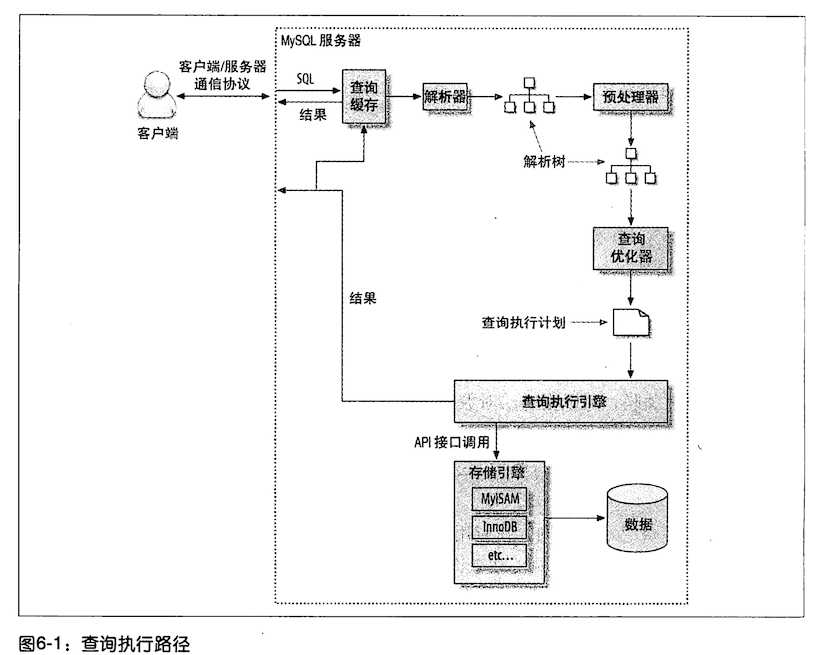
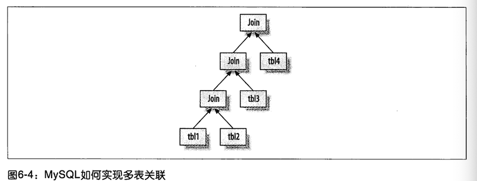

# 查询执行的基础

当希望 MySQL 能够以更高的性能运行查询时，最好的办法就是弄清楚 MySQL 是如何优化和执行查询的。一旦理解这一点，很多查询优化工作实际上就是遵循一些原则让优化器能安装预想的合理的方式运行。

换句话说，是时候回头看看前面讨论的内容类：MySQl 执行一个查询的过程。根据下图，我们可以看到当向 MySQL 发送一个轻轻的时候，MySQL 到底做了什么：



1. 客户端发送一条查询给服务器
2. 服务器先检查缓存，如果命中了缓存，则立刻返回缓存中的结果。否则进入下一阶段
3. 服务器端进行 SQL 解析、预处理，再由优化器生成对应的执行计划。
4. MySQL 根据优化器生成的执行计划，调用存储引擎的 API 来执行查询
5. 将结果返回客户端。

## MySQL 客户端/服务器通信协议

一般来说，不需要去理解 MySQL 通信协议的内实现细节，值需要理解通信协议是如何工作的。MySQL 客户端和服务器之间的 **通信协议是「半双工」**的，这意味着，在任何一个时刻，要么是由服务器向客户端发送数据，要么是客户端向服务器发送数据，这两个动作不能同时发生。所以，我们无法也无须将一个消息切成小块独立来发送。

这种协议让 MySQL **通信简单快速**，但是也从很多地方限制了 MySQL。一个明显的限制是：这意味着 **没法进行流量控制**。一旦一端开始发送消息，另一端要接收完整消息才能响应它。这就像来回抛球的游戏：**在任何时刻，只有一个人能控制球，而且只有控制球的人才能将球抛回去（发送消息）**

客户端用一个单独的数据包将查询传给服务器。这也是为什么当查询的语句很长的时候，参数 **max_allowed_packet ** 就特别重要了（如果查询太大，服务端会拒绝接收更多的数据并抛出相应错误）。一旦客户端发送了请求，它能做的事情就只有等待结果了。

相反的，一般服务器响应给用户的数据通常很多，由多个数据包组成。当服务器开始响应客户端请求时，客户端必须完整的接收整个返回结果，而不能简单的只取前面几条结果，然后让服务器停止发送数据。这种情况下，客户端若接收完整的结果，然后取前面几条需要的结果，或则接收完几条后，就粗暴的断开连接，都不是好主意。这也是在必要的时候一定要在查询加上 limit 限制的原因。

换一种方式解释这种行为：当 **客户端从服务器取数据** 时，看起来是一个 **拉数据的过程**，但实际上是 **MySQL 在向客户端推送数据的过程**。客户端不断的接收从服务器推送的数据，客户端也没法让服务器停下来。客户端就像是「从消防水管喝水」

多数连接 MySQL 的库函数都可以获得全部结果集并缓存到内存里，还可以逐行获取需要的数据。默认一般是 **获得全部结果集并缓存到内存中**。 MySQL** 通常需要等所有的数据都已经发送给客户端** 才能 **释放这条查询占用的资源**，所以接收全部结果并缓存通常可以减少服务器的压力，让查询能够早点结束、早点释放相应的资源。

当使用多数连接 MySQl 的库函数从 MySQL 获取数据时，其结果看起来都像是从 MySQL 服务器获取数据，实际上都是从这个库函数的缓存获取数据。多数情况下着没有问题，但是如果需要返回一个很大的结果集，这样并不好，因为库函数会花很多时间和内存来存储所有的结果集。如果能尽早开始处理这些结果集，就能大大减少内存的消耗，这种情况下可以不使用缓存来记录结果而是直接处理。这样做的缺点就是，对于服务器来说，需要查询完成后才能释放资源，所以在和客户端的交互的整个过程中，服务器的资源都是被整个查询所占用的。

看看使用 php 的时候是什么情况，下面是链接 MySQL 的通常写法

```php
<? php
	$link = mysql_connect(‘localhost’,'user','p4ssword')
  $result = mysql_query('select * from huge_table',$link)
  while($row = mysql_fetch_array($result)){
    // 为结果做点什么
  }
>
```

这代码看起来像只有当你需要的时候，才通过循环从服务器端取出数据。实际上，在调用 `mysql_query()` 的时候，php 就已经将整个结果集缓存到内中。

不同语言处理缓存的方式不同。这里不继续说明

## 查询状态

对于一个 MySQL 链接，或则说一个线程，任何时刻都有一个状态，**该状态表示了 MySQL 当前正在做什么**。有喝多中方式查看当前的状态，最简单的是使用 `show full processlist`(该命令返回结果中的 command 列就表示当前的状态)。在一个查询的生命周期中，状态会变化很多次。MySQL 官方手册中对这些状态值的含义最优权威的解释，下面做一个简单的解释。

- Sleep：线程正在等待客户端发送新的请求

- Query：线程正在执行查询或则正在将结果发送客户端

- Locked：在 MySQL 服务器层，该线程正在等待表锁。

  在存储引擎级别实现的锁，例如 InnoDB 的行锁，并不会体现在线程状态中。对于 MyISAM 来说这是一个比较典型的状态，但在其他没有行锁的引擎中也经常会出现。

- Analyzing and statistics：线程正在收集存储引擎的统计信息，并生成查询的执行计划

- Copying to tmp table `[on disk]`

  线程正在执行查询，并且将其结果集都复制到一个临时表中，这种状态一般要么是在做 group by 操作，要么是文件排序操作，或则是 union 操作。如果这个状态后面还有 `on disk` 标记，则表示 MySQL 正在将一个内存临时表放到磁盘上。

- Sorting result：线程正在对结果集进行排序。

- Sending data：这表示多种情况

  - 线程可能在多个状态之间切换
  - 或则在生成结果集
  - 或则在向客户端返回数据

了解这些状态的基本含义非常有用，可以让你很快了解当前「谁在持球」。在一个繁忙的服务器上，可能会看到大量的不正常的状态，例如 statistics 正占用大量的时间。这通常表示，某个地方异常了，可以通过第 3 章的一些技巧来诊断到底是哪个环节出现了问题。

## 查询缓存

在解析一个查询语句之前，如果查询缓存是打开的。 那么 MySQL 会优先检查这个查询是否命中查询缓存中的数据。这个检查是通过一个 **对大小写敏感的哈希查找** 实现的。查询和缓存中的查询即使只有一个字节不同，那也不会匹配缓存结果，这情况下查询就会进入下一阶段。

如果当前的查询恰好 **命中了缓存查询**，那么 **在返回查询结果之前**，会 **检查一次用户权限**。这仍然是无须解析查询 SQL 语句的，因为在查询缓存中已经存放了当前查询需要访问的表信息。如果权限没有问题，MySQL 会跳过所有其他阶段，直接从缓存中拿到结果并返回给客户端。这种情况下，查询不会被解析，不用生成执行计划，不会被执行。在第 7 章中的查询缓存一节，你将学习到更多的细节

## 查询优化处理

查询的生命周期下一步是 **将一个 sql 转换成一个执行计划**，MySQL 再依照这个执行计划和存储引擎进行交互。这包括多个子阶段：

- 解析 sql
- 预处理
- 优化 sql 执行计划

这个过程中任何错误（例如语法错误）都可能终止查询。这里不打算详细介绍 MySQL 内部实现，而只是选择性的介绍其中几个独立的部分，在实际执行中，这几部分可能一起执行也可能单独执行。

### 语法解析器和预处理

首先 MySQL 通过关键字将  sql 语句进行解析，并 **生成一颗对应的「解析树」**。MySQL 解析器将使用 MySQL 语法规则验证和解析查询。例如，它将验证是否使用错误的关键字，或则使用关键字的顺序是否正确等，或则验证引号是否能前后正确匹配。

预处理则根据一些 MySQL 规则进一步检查解析树是否合法，例如：这里将检查数据表和数据列是否存在，还会解析名字和别名，看看他们是否有歧义。

下一步预处理会验证权限。这通常很快，除非服务器上有很多的权限配置。

### 查询优化器

选择语法树被认为是合法的了，并且 **由优化器将其转化成执行计划**。一条查询可以有多种执行方式，最后都返回相同的结果。优化器的作用就是找到这其中最好的执行计划。

**MySQL 使用基于成本的优化器**，将尝试预测一个查询使用某种执行计划时的成本，并选择其中成本最小的一个。最初，成本的最小单位是随机读取一个 4k 数据页的成本，后来（成本计算公式）变得更复杂，并且引入了一些 **「因子」**来估算某些操作的代价，如当执行一次 where 条件比较的成本。可以通过查询当前会话的 `Last_query_cost` 的值来得知 MySQL 计算的当前查询的成本。

```sql
select sql_no_cache count(*)
from sakila.film_actor;

show status like 'Last_query_cost';
```

| Variable\_name | Value |
| :--- | :--- |
| Last\_query\_cost | 1040.090000 |

这个结果表示 MySQL 的优化器认为大概需要做 1040 个数据页的随机查找才能完成上面的查询。这是根据一系列的统计信息计算得到的：

- 每个表或则索引的页面个数
- 索引的技术（索引中不同值的数量）
- 索引和数据行的长度
- 索引分布情况

优化器在评估成本的时候并不会考虑任何层面的缓存，他假设读取任何数据都需要一次磁盘 I/O。

有很多中原因会导致 MySQL 优化器选择错误的执行计划，如下所示：

- 统计信息不准确

  MySQL 依赖存储引擎提供的统计信息来评估成本，但是有的存储引擎提供的信息是准确的，有的偏差可能非常大。例如 ，InnoDB 因为其 MVCC 的架构，并不能维护一个数据表的行数的精确统计信息。

- 执行计划中的成本估算不等同于实际执行的成本

  即使统计信息精准，优化器给出的执行计划也可能不是最优的。例如有时候某个执行计划虽然需要读取更多的页面，但是它的成本却更小。因为如果这些页面都是顺序读或则这些页面都已经在内存中的话，那么它的访问成本很小。MySQL 层面并不知道那些页面在内存中、那些在磁盘上，所以查询实际执行过程中到底需要多少次物理 I/O 是无法得知的。

- MySQL 从不考虑其他并发执行的查询

  这可能会影响到当前查询的速度

- MySQL 也并不是任何时候都基于成本的优化

  有时候也会基于一些固定的规则。例如，如果存在全文搜索的 `match（）` 子句，则存在全文索引的时候就使用全文索引。即使有时候使用别的索引和 where 条件可以更快查询到，MySQL 也任然会使用对应的全文索引。

- MySQL 不会考虑不受其控制的操作成本

  例如执行存储过程或则用户自定义函数的成本

- 优化器有时候无法去估算所有可能的执行

  这一点后面会看到，所以它可能错过时机上最优的执行计划。

MySQL 的查询优化器是非常复杂的部件，它 **使用了很多优化策略来生成一个最优的执行计划**。优化策略可以简单分为两种：

- 静态化	

  可以直接对解析树进行分析，并完成优化。

  例如：优化器可以通过一些简单的代数变换将 where 条件转换成另一种等价形式。静态优化不依赖于特别的数值，如 where 条件中带入的一些常数等。静态优化在第一次完成后就一直有效，即使使用不同的参数重复执行查询也不会发生变化。

  **可以认为这是一种「编译时优化」**

- 动态化

  相反，动态优化则和查询的上下文有关，也可能和很多其他因素有关，例如 where 条件中的取值、索引条目对应的数据行数等。这需要在每次查询的时候都重新评估

  **可以认为这是「运行时优化」**

在执行语句和存储过程的时候，动态优化和静态优化的区别非常重要。MySQL 对查询的静态优化只需要做一次，但对查询的动态优化则每次执行都需要重新评估。有时候甚至在查询的执行过程中也会重新优化（例如：在关联操作中，范围检查的执行计划会针对每一行重新评估索引。可以通过 explain 执行计划中的 Extra 列是否有 「range checked for each record」来确认这一点。该执行计划还会增加 select_full_range_join 这个服务器变量的值）。

下面是一些 MySQL 能够处理的优化类型：

- 重新定义关联表的顺序

  数据表的的关联并不总是按照查询中指定的顺序进行。决定关联的顺序是优化器很重要的一部分功能。本章后面将深入介绍这一点。

- 将外连接转化为内连接

  并不是所有的 `outer join` 语句都必须以外连接的方式执行。

  诸多因素，例如 where 条件、库表结构都可能会让外连接等价于一个内连接。MySQL 能够识别这点并重写查询，让其可以调整关联顺序。

- 使用等价变换规则

  MySQL 可以使用一些等价变换来简化并规范表达式。它可以合并和减少一些比较，还可以移除一些恒成立和一些恒不成立的判断。

  例如：`(5=5 and a>5)` 将被改写为 `a>5` 。类似的，如果有 `(a<b and b=c) and a=5`则会改写成 `b>5 and b=c and a=5`。这些规则对于我们编写条件语句很有用，我们将在后续讨论

- 优化 `count()、min（）、maxn()`

  **索引和列是否可为空通常可以帮助 MySQL 优化这类表达式。**

  例如：要找到某一列的最小值，值需要查询对应 B-Tree 索引最左端的记录，MySQL 可以直接获取索引的第一行记录。在优化器生成执行计划的时候就可以利用这一点，在 B-tree 索引中，优化器会将整个表达式作为一个 **常数** 对待。类似的，如果要找一个最大值，也值需要读取 B-Tree 索引的最后一条记录。**如果 MySQL 使用了这种类型的优化，那么在 explain 中就可以看到 「Select tables optimized away」**。 从字面意思可以看出，它表示优化器已经从执行计划中移除了该表，并以一个常数取而代之。

  类似的，没有任何 where 条件的 `count(*)` 查询通常也可以使用存储引擎提供的一些优化（例如：MyISAM 维护了一个变量来存放数据表的行数）

- 预估并转化为常数表达式

  **当 MySQL 检测到一个表达式可以转化为常数的时候，就会一直把该表达式作为常数进行优化处理**

  例如：一个用户自定义变量在查询中没有发生变化的时候就可以转换为一个常数。数学表达式则是另一种典型的例子。

  **在优化阶段，有时候甚至一个查询也能够转化为一个常数**。一个例子是在索引列上执行 `min()` 函数。甚至是主键或则唯一键查找语句也可以转换为常数表达式。如果 where 子句中使用了该类索引的常数条件，MySQL 可以在查询开始阶段就先查找这些值，这样优化器就能知道并转换为常数表达式。下面是一个例子

  ```sql
  explain
  select film.film_id, film_actor.actor_id
  from sakila.film
           inner join sakila.film_actor using (film_id)
  where film.film_id = 1;
  ```
  | id | select\_type | table | partitions | type | possible\_keys | key | key\_len | ref | rows | filtered | Extra |
  | :--- | :--- | :--- | :--- | :--- | :--- | :--- | :--- | :--- | :--- | :--- | :--- |
  | 1 | SIMPLE | film | NULL | const | PRIMARY | PRIMARY | 2 | const | 1 | 100 | Using index |
  | 1 | SIMPLE | film\_actor | NULL | ref | idx\_fk\_film\_id | idx\_fk\_film\_id | 2 | const | 10 | 100 | Using index |

  MySQL 分两步来执行这个查询，也就是上面执行计划的两行输出。

  第一步：先从 film 表找到需要的行。因为在 film_id 字段上有主键索引，所以优化器知道这只会返回一行数据，优化器在生成执行计划的时候，就已经通过索引信息知道将返回多少行数据。因为优化器已经明确知道有多少个值（where 条件中的值）需要做索引查询，所以这里的表访问类型是 const。

  第二步：MySQL 将第一步中返回的 film_id 列当做一个已知值的列来处理。因为优化器清楚在第一步执行完成后，该值就会是明确的了。注意到正如第一步中一样，使用 film_actor 字段对表的访问类型也是 const。

  另一种会看到常数条件的情况是通过等式将常数值从一个表传到另一个表，这可以通过 where、using 或则 on 语句来限制某列取值为常数。在上面的例子中，因为使用了 using 子句，优化器知道这也限制了 film_id 在整个查询过程中都始终是一个常量：因为它必须等于 where 子句中的那个值

- 索引覆盖扫描

  当索引中的列包含所有查询中需要使用的列的时候，MySQL 就可以使用索引返回需要的数据，而无需查询对应的数据行

- 子查询优化

  MySQL 在某些情况下可以将子查询转换为一种效率更高的形式，从而减少多个查询多次对数据进行访问。

- 提前终止查询

  当发现已经满足查询需求的时候，MySQL 总是能立刻终止查询。

  一个典型的例子是当使用了 limit 的子句的时候。初此之外，MySQL 还有几类情况也会提前终止查询，例如：发现了一个不成立的条件，这时 MySQL 可以立刻返回一个空结果。

  当存储引擎需要检索「不同取值」或则判断存在性的时候，MySQL 都可以使用这类优化。例如：我们需要找到没有演员的所有电影

  ```sql
  explain
  select film.film_id
  from sakila.film
           left outer join sakila.film_actor using (film_id)
  where film_actor.film_id is null;
  ```

  | id | select\_type | table | partitions | type | possible\_keys | key | key\_len | ref | rows | filtered | Extra |
  | :--- | :--- | :--- | :--- | :--- | :--- | :--- | :--- | :--- | :--- | :--- | :--- |
  | 1 | SIMPLE | film | NULL | index | NULL | idx\_fk\_language\_id | 1 | NULL | 1000 | 100 | Using index |
  | 1 | SIMPLE | film\_actor | NULL | ref | idx\_fk\_film\_id | idx\_fk\_film\_id | 2 | sakila.film.film\_id | 5 | 100 | Using where; Not exists; Using index |

  这个查询会过滤所有演员的电影。每一部电影可能会有很多的演员，但是上面的查询一旦找到任何一个，就会停止并立刻判断下一部电影，因为只要有一名演员，那么 where 条件则会过滤掉这类电影。

  类似这种「不同值/不存在」的优化一般可用于 `distinct、not exist()、left join` 类型的查询。

- 等值传播

  如果两个列的值通过等式关联，那么 MySQL 能够把其中一个列的 where 条件传递到另一列上。例如下面的查询

  ```sql
  explain
  select film.film_id
  from sakila.film
           inner join sakila.film_actor using (film_id)
  where film.film_id > 500;
  ```

  因为这里使用了 film_id 字段进行等值关联，MySQL 知道这里的 where 子句不仅适用于 film 表，而且对于 film_actor 表同样适用。如果使用的是其他的数据库管理系统，可能还需要手动通过一些条件来告知优化器这个 where 条件适用于两个表，那么写法如下：

  ```sql
  where film.film_id > 500 and film_actor.film_id > 500;
  ```

  在 MySQL 中这是不必要的，这样写反而会让查询更难维护。

- 列表 `in()` 的比较

  在很多数据库系统中， `in()` 完全等同于多个 OR 条件的子句，因为这两者是完全等价的。在 MySQL 中这点是不成立的，MySQL 将 `in()` 列表中的数据先进行排序，然后通过二分查找的方式来确定列表中的值是否满足条件，这是一个 `o(log n)` 复杂度的操作，等价转换成 or 查询的复杂度为`O(n)`，**对于 `In()` 列表中有大量取值的时候，MySQl 的处理速度将会更快**。

上面的列举只是其中一部分，MySQL 还会做大量的其他优化，即使本章全部用来描述也不够。但上面的例子也已经足够让你明白优化器的复杂性和智能性了。如果从上面这些讨论中我们应该学到什么，那就是 **不要自以为优化器更聪明**。最终你可能会占点偏移，但是更有可能会使查询变得更加复杂而难以维护，而最终的收益却为零。让优化器按照它的方式工作就可以了。

虽然优化器已经很智能了，**但是有时候也无法给出最优的结果**。有时候你可能比优化器更了解数据。

例如：

- 由于应用逻辑使得某些条件总是成立
- 优化器缺少某种功能特性，如哈希索引
- 从优化器执的执行成本角度评估出来的最优执行计划，实际运行中可能比其他的执行计划更慢

如果能确认优化器给出的不是最佳选择，并且清楚背后的原理，那么也可以帮助优化器做进一步的优化。例如，可以在 **查询中添加 hint 提示**，也可以重写查询，或则重写设计更优的库表结构，或则添加更合适的索引。

### 数据和索引的统计信息

MySQL 架构由多个层次组成。在 **服务器层有查询优化器，却没有保存数据和索引的统计信息**。统计信息由存储引擎实现，不同的存储引擎可能会存储不同的统计信息（也可以按照不同的格式存储统计信息）。某些引擎，没有存储任何统计信息。例如 Archive 引擎。

因为服务器层没有任何统计信息，所以 MySQL 查询器在生成查询的执行计划时，需要向存储引擎获取相应的统计信息。**存储引擎则提供给优化器对应的统计信息**，包括：

- 每个表或则索引有多少个页面
- 每个表的每个索引的基数是多少
- 数据行和索引长度
- 索引的分布信息等

优化器根据这些信息来选择一个最优的执行计划。在后面的小结中我们将看到 **统计信息是如何影响优化的**

### MySQL 如何执行关联查询

**MySQL 认为任何一个查询都是一次「关联（join）」**，并不仅仅是一个查询需要到两个表匹配才叫关联，所以在 MySQL 中，每一个查询、每一个片段（包括子查询、甚至基于单表的 select）都可能是关联。

所以，理解 MySQL 如何执行关联查询至关重要。先来看一个 UNION 查询的例子。

对于 union 查询：MySQL 先将一系列 **单个查询结果放到一个临时表** 中，**然后再重新读出临时表 ** 的数据来完成 union 查询。在 MySQL 的概念中，每个查询都是一次关联，所以 **读取结果临时表也是一次关联**。

当前 MySQL 关联执行的策略很简单：**MySQL 对任何关联都执行嵌套循环关联操作**：

- 即 MySQL 先在一个表中循环出单条数据
- 然后再嵌套环到下一个表中寻找匹配的行，依次下去，直到找到所有列表中匹配的行为位置。
- 然后根据各个表匹配的行，返回查询中需要的各个列。

MySQL 会尝试在最后一个关联表中找到所有匹配的行，如果最后一个关联表无法找到更多的行，MySQL 返回到上一层关联表，看是否能找到更多的匹配记录，依次类推迭代执行。

按照这样的方式查找第一个表记录，再嵌套查询下一个表关联，然后回溯到上一个表，在 MySQL 中是通过嵌套循环的方式实现。例如：

```sql
select tbl1.col1, tbl2.col2
	from tbl1 inner join tabl2 using(col3)
	where tbl1.col1 in(5,6)
```

假设按照查询中的表顺序进行关联操作。可以用如下的伪代码表示 MySQL 如何完成这个查询

```sql
outer_iter = iterator over tbl1 where col1 in(5,6)   -- 从 tbl1 表中过滤数据
outer_row = outer_iter.next
while outer_row			-- 循环上表找到的数据行
	-- 每一行都去循环 tbl2 查找匹配的 col3 的数据
	inner_iter = iterator over tbl2 where col3 = outer_row.col3
	-- 有可能找到多行
	inner_row = inner_iter.next
	-- 循环输出匹配到的数据
	while inner_row
		ouput [ outer_row.col1, inner_row.col2 ]
		inner_row = inner_iter.next
	end
	outer_row = outer_iter.next
end
```

上面的执行计划对于单表查询和多表关联查询都适用，如果是一个单表查询，只需要完成外层的查询。

另一种 **可视化查询执行计划是根据优化器执行的路径绘制出对应的「泳道图」**，如下图绘制了上面查询的泳道图，从左到右，从上到下看这幅图


从本质上说，MySQL对所有的类型的查询都以同样的方式运行。例如：MySQL 在 from 子句中遇到子查询时：

- 先执行子查询并将其结果放到一个临时表中（**临时表没有任何索引**，在编写复杂的子查询和关联查询的时候要注意这一点，**这一点对 union 查询也一样**）
- 然后将整个临时表当做一个普通表对待（派生表）

MySQL 在执行 union 查询时也使用类似的临时表，在 **遇到右外连接**的时候，MySQL **将其改写成等价的左外连接**。简而言之，**当前版本的 MySQL 会将所有的查询类型都转换成类似的执行计划**

不过，**不是所有的查询都可以转换成上面的形式**。例如，全外连接就无法通过嵌套循环和回溯的方式完成，这时当发现关联表中没找到任何匹配行的时候，则可能因为关联恰好从一个没有任何匹配的表开始。这大概也是 MySQL 并不支持全外连接的原因。还有些场景，虽然可以转换成嵌套循环的方式，但是效率非常差，后面我们会看一个这样的例子。

### 执行计划

和很多其他关系数据库不同，MySQL 并不会生成查询字节码来执行查询。**MySQL 生成查询的一颗指令树**，然后通过存储引擎执行完成这棵树指令并返回结果。最终的执行计划包含了重构查询的全部信息。如果对某个查询执行 `explain extended` 后，再执行 `show warnings`，就可以看到重构出的查询（根据计划生成输出。这和原查询有完全相同的语义，但查询语句可能并不完全相同）。

这里的 `explain extended ` 笔者测试报语法错误。

**任何多表查询都可以使用一棵树表示**。例如，下面是一个四表相关联操作。


在计算机科学中，这被称为一颗 **平衡树**。但这并不是 MySQL 执行查询的方式。**MySQL 总是从一个表开始一直嵌套循环、回溯完成所有表关联。**所以，MySQL 的执行计划总是如下图所示，是一颗 **左侧深度优先的树**



### 关联查询优化器

MySQL 优化器最重要的一部分就是 **关联查询优化，它决定了多个表关联时的顺序**。通常多表关联的时候，可以有多种不同的关联顺序来获得相同的执行结果。关联查询优化器则通过 **评估不同顺序时的成本来选择一个代价最小的关联顺序**。

下面的查询可以通过不同顺序的关联最后都获得相同的结果

```sql
select film.film_id,
       film.title,
       film.release_year,
       actor.actor_id,
       actor.first_name,
       actor.last_name
from sakila.film
         inner join sakila.film_actor using (film_id)
         inner join sakila.actor using (actor_id)
```

容易看出，可以通过一些不同的执行计划来完成上面的查询。例如 ：

- MySQL 可以从 film 表开始，使用 film_actor 表的索引 film_id 来查找对应的 actor_id 值
- 然后再跟进 actor 表的主键找到对应的记录

我们使用 explain 看看 MySQL 将如何执行这个查询：

| id | select\_type | table | partitions | type | possible\_keys | key | key\_len | ref | rows | filtered | Extra |
| :--- | :--- | :--- | :--- | :--- | :--- | :--- | :--- | :--- | :--- | :--- | :--- |
| 1 | SIMPLE | actor | NULL | ALL | PRIMARY | NULL | NULL | NULL | 200 | 100 | NULL |
| 1 | SIMPLE | film\_actor | NULL | ref | PRIMARY,idx\_fk\_film\_id | PRIMARY | 2 | sakila.actor.actor\_id | 27 | 100 | Using index |
| 1 | SIMPLE | film | NULL | eq\_ref | PRIMARY | PRIMARY | 2 | sakila.film\_actor.film\_id | 1 | 100 | NULL |

和我们猜测的完全不同。它先从 actor 表开始，然后与我们前面的计划按照相反的顺序关联。这样是否效率更高呢？我们先使用 `staraight_join` 关键字，按照我们之前的顺序执行，这里是对应的 explain 输出结果

```slq
explain
select film.film_id,
       film.title,
       film.release_year,
       actor.actor_id,
       actor.first_name,
       actor.last_name
from sakila.film
         STRAIGHT_JOIN sakila.film_actor on film.film_id = film_actor.film_id
         inner join sakila.actor using (actor_id);
```

| id | select\_type | table | partitions | type | possible\_keys | key | key\_len | ref | rows | filtered | Extra |
| :--- | :--- | :--- | :--- | :--- | :--- | :--- | :--- | :--- | :--- | :--- | :--- |
| 1 | SIMPLE | film | NULL | ALL | PRIMARY | NULL | NULL | NULL | 1000 | 100 | NULL |
| 1 | SIMPLE | film\_actor | NULL | ref | PRIMARY,idx\_fk\_film\_id | idx\_fk\_film\_id | 2 | sakila.film.film\_id | 5 | 100 | Using index |
| 1 | SIMPLE | actor | NULL | eq\_ref | PRIMARY | PRIMARY | 2 | sakila.film\_actor.actor\_id | 1 | 100 | NULL |

`STRAIGHT_JOIN` 只适合 `inner join`; 来分析下为什么 MySQL 会将关联顺序倒转过来：

- 选择 film 表会查询出 1000 行记录，然后对 film_actor 和 actor 表进行嵌套循环查询
- 如果选择 actor 表，只返回 200 条记录进行后面的嵌套循环查询。

简单说，**倒转的关联顺序会让查询进行更少的嵌套循环和回溯操作**。为了验证优化器的选择是否正确，我们单独执行者两个查询，并看看对应的 `Last_query_cost` 状态值

```sql
show status like 'Last_query_cost';  -- 可以查询上一条查询语句的成本
-- 可是笔者这里查询都是 0 不知道是因为电脑太快的缘故？
```

书上来说，他们分别执行后，一个是 241，原来的查询未 154.

关联优化器会 **尝试在所有的关联顺序中选中一个成本最小的来生成执行计划树**。如果可能，优化器会遍历每一个表然后逐个做嵌套计算每一棵可能的执行计划树的成本，最后返回一个最优的执行计划

不过，糟糕的是，如果有超过 n 个表的关联，那么需要检查 n 的阶乘种关联顺序。我们称之为 **所有可能的执行计划的「搜索空间」**，搜索空间的增长速度非常快。

例如：若是 10 个表的关联，那么共有 `3 628 800` 种不同的关联顺序。

当搜索空间非常大的时候，优化器**不可能逐一评估每一种关联顺序的成本**。这时，**优化器选择使用「贪婪」搜索** 的方式查找「最优」的关联顺序。实际上，当需要关联的表超过 `optimizer_search_depth` 的限制的时候，就会选择「贪婪」搜索模式了。

在 MySQL 发展过程中，优化器积累了很多「启发式」的优化策略来加速执行计划的生成。绝大多数情况下，这都是有效的，但因为不会去计算每一种关联顺序的成本，所以偶尔也会选择一个不是最优的执行计划。

有时，**各个查询的顺序并不能随意安排，这时关联优化器可以根据这些规则大大减少搜索空间**。例如：左连接、相关子查询（后面会继续讨论）。这是因为，**后面的表的查询需要依赖于前面表的查询结果**。这种依赖关系通常可以帮助优化器大大减少需要扫描的执行计划数量。

### 排序优化

无论如何排序都是一个成本很高的操作，所以从性能角度考虑，应尽可能避免排序或则尽可能避免对大量数据进行排序。

当不能使用索引生成排序结果的时候，MySQL 需要进行自己排序，如果 **数据量小则在内存中进行**，**数据量大则需要磁盘**，不过 **MySQL 将整个过程统一称为 文件排序（filesort）**，即使完全是内存排序不需要任何磁盘文件时也是如此。

如果需要 **排序的数量小于「排序缓冲区」**，MySQL 使用 **内存进行「快速排序」**操作。如果内存不够排序，那么会先将 **数据分块**，**对每个独立的块使用「快速排序」进行排序**，并 **将各个块的排序结果存放在磁盘上**，然后将各个排好序的块进行 **合并（merge）**，最后返回排序结果。

MySQL 有如下两种排序算法：

- 两次传输排序（旧版本使用）

  读取行指针和需要排序的字段，对齐进行排序，然后再跟进排序结果读取所需要的数据行。

  这需要进行两次数据传输，即需要从数据表中读取两次数据，第二次读取数据的时，因为是 **读取排序列进行排序后的所有记录**，这会 **产生大量的随机 I/O**，所以两次数据传输排序成本非常高。

  当使用 MyISAM 表的时候，成本可能会更高，因为 MyISAM 使用系统调用进行数据的读取（非常依赖操作系统对数据的缓存）。不过这样做的优点是：在排序的时候存储尽可能少的数据，这就让「排序缓冲区」中可能容纳尽可能多的行数进行排序

- 单词传输排序（新版本使用）

  **先读取查询所需要的所有列**，然后再跟进给定列进行排序，最后直接返回排序结果。

  这个算法值在 MySQL 4.1+ 有效。因为不再需要从数据表中读取两次数据，对于 I/O 密集型的应用，这样做的效率高了很多。另外，相比两次传输排序，该算法只需要一次顺序 I/O 读取所有的数据，而无须任何的随机 I/O。

  缺点是：如果需要返回的列非常多、非常大，会额外占用大量的空间，而这些列队排序操作本身来说没有任何的作用。因为单条排序记录很大，所以有可能会有更多的排序块需要合并。

  两种算法都有各自最好和最糟的场景。当查询需要所有列的总长度不超过参数 `max_length_for_sort_data` 时，MySQL 使用「单次传输排序」，可以通过调整该参数影响 MySQL 排序算法的选择。关于这个细节，可以参考第 8 章「文件排序优化」。

MySQL 在进行 **文件排序** 的时候需要 **使用临时存储空间** 可能会比想象的要大得多。原因在于 MySQL 排序时，**对每一个排序记录都会分配一个足够长的定长空间来存放。**这个定长空间必须足够长以容纳其中最长的字符串。例如：如果是 varchar 列则需要分配其完整长度，如果使用 UTF8 字符集，则会为每个字符预留三个字节。

我们曾经在一个库表结构设计不合理的案例中看到，**排序消耗的临时空间比磁盘上的原表要大很多倍**。

当关联查询时如果需要排序，分两种情况来处理这样的文件排序：

- 如果 order by 子句中的所有列都来自关联的第一个表

  MySQL 在 **关联处理第一个表的时候就进行文件排序**。在 explain 中可以看到  Extra 字段会有 `Using filesort`

- 其他的所有情况

  MySQL 都会 **先将关联的结果存放到一个临时表**中，然后在所有的关联都结束后，再进行文件排序。这种情况下，可以看到 Extra 中有 `Using temporary; Using filesort`。如果 **查询中有 limit 的话，limit 也会在排序之后应用**，所以即使返回较少的数据，临时表和需要排序的数据量仍然会非常大。

## 查询执行引擎

在 **解析和优化阶段**，MySQL 将 **生成查询对应的执行计划**，MySQL 的查询执行引擎则根据这个计划来完成整个查询。这里 **执行计划是一个数据结构**，而不是和很多其他的关系型数据库那样会生成对应的字节码。

相对于查询优化阶段，查询执行阶段不是那么复杂：MySQL 只是简单的根据执行计划给出的指令逐步执行。在 **执行过程中，有大量的操作需要通过调用存储引擎实现的接口来完成**，这些接口我们称为 **handler API **的接口。查询中的每一个表由一个 handler 的实例表示。前面我们有意忽略了这点，实际上 MySQL 在优化阶段就为每个表创建了一个 handler 实例，优化器根据这些实例的接口可以获取表的相关信息，包括表的所有列名、索引统计信息，等等。

存储引擎接口有很丰富的功能，但是底层接口却只有几十个，这些接口像「搭积木」一样能够玩出查询的大部分操作。例如，有一个查询某个索引的第一行的接口，再由一个查询某个索引条目的下一个条目的功能，我们就可以完成全索引扫描的操作了。这种简单的接口模式，让 MySQL 的存储引擎插件式架构称为可能，但是正如前面的讨论，也给优化器带来了一定的限制。

注：并不是所有的操作都由 handler 完成。例如，当 MySQL 需要进行锁表的时候，handler 可能会实现自己的级别的、更细粒度的锁，如 InnoDB 就实现了自己的行基本所，但这病不能代替服务器层的表锁。正如我们第 1 章所介绍的，如果是所有存储引擎共有的特性则由服务器层实现，比如时间和日期函数、视图、触发器等。

为了执行查询，MySQL 值需要重复执行计划中的各个操作，直到完成所有的数据查询。